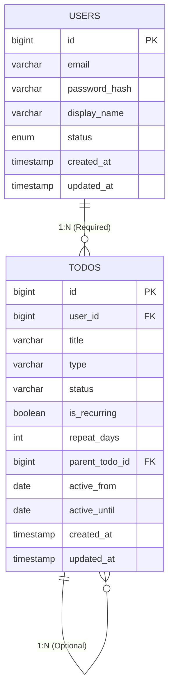

```mermaid
erDiagram

    USERS ||--o{ TODOS : "1:N (Required)"
    TODOS ||--o{ TODOS : "1:N (Optional)"

    USERS {
        bigint id PK
        varchar email
        varchar password_hash
        varchar display_name
        enum status
        timestamp created_at
        timestamp updated_at
    }

    TODOS {
        bigint id PK
        bigint user_id FK
        varchar title
        varchar type
        varchar status
        boolean is_recurring
        int repeat_days
        bigint parent_todo_id FK
        date active_from
        date active_until
        timestamp created_at
        timestamp updated_at
    }
```

